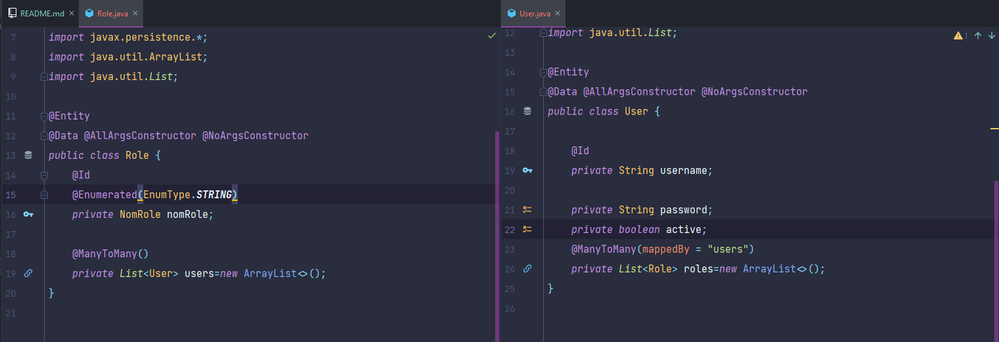
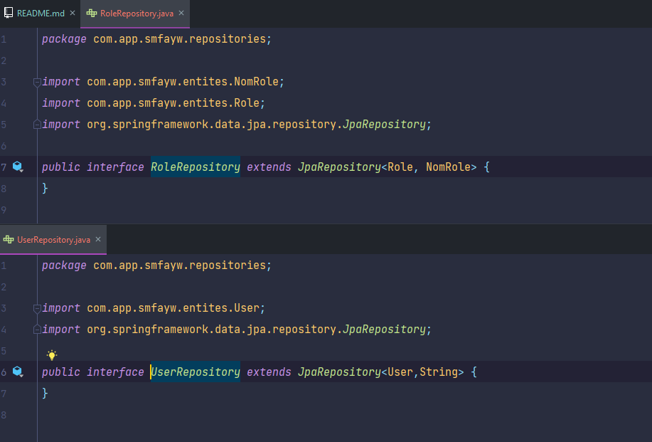
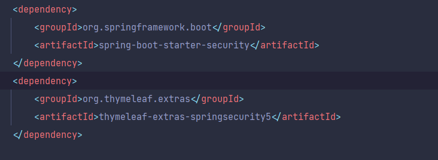
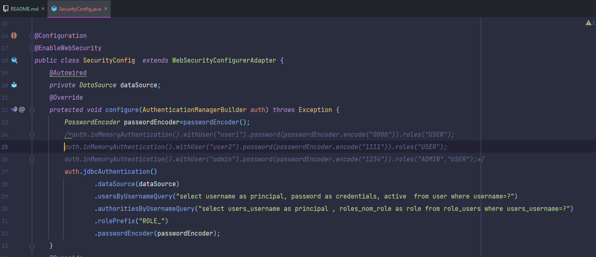
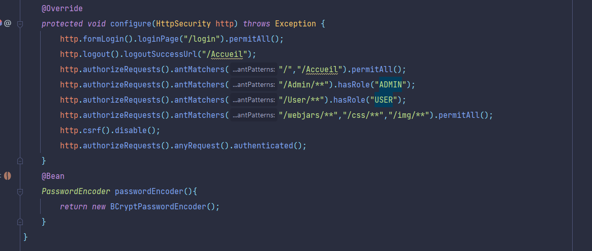
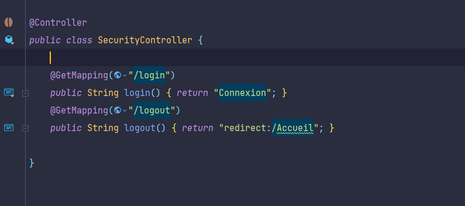
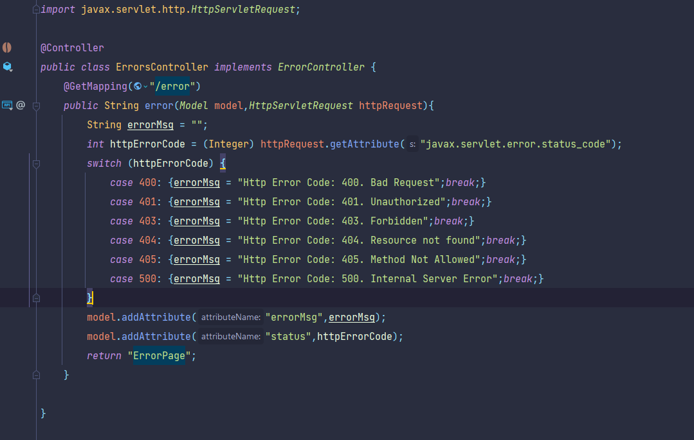
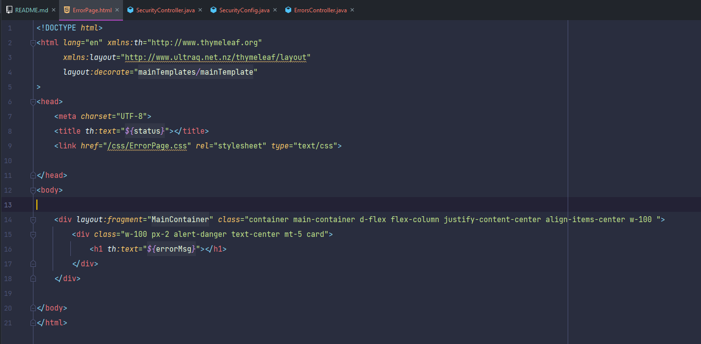
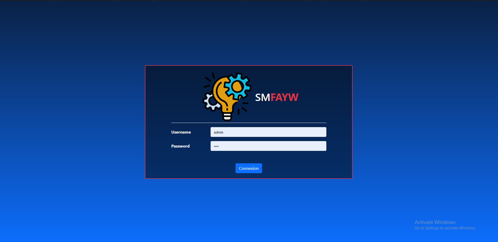
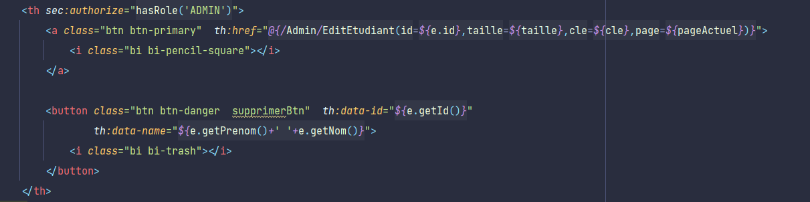

#<h1 align="center">Student Management Fast As You Want (SMFAYW)</u>

## application Web de gestion des etudiants :
   * une application Web basée sur Spring MVC, Spring Data JPA et Spring Security qui permet de gérer des étudiants
   

###   creation de l'entité étudiant et leur repository :
   * Entite :(`src\main\java\com\app\smfayw\entites\Etudiant.java`)
   * repository : (`src\main\java\com\app\smfayw\repositories\EtudiantRepository.java`)
   * Chaque étudiant est défini par:
   

### partie web :

   * création de controlleur pour Etudiant (`src/main/java/com/app/smfayw/web/EtudiantController.java`)
   * création de deux routes :
   
   

   * création de mainTemplate.html (`src/main/resources/templates/mainTemplates/mainTemplate.html`) : contient navbar et deux fragments
     * fragment pour container de la page
     * fragment pour script
     
   * créationn de la page d'accueil (`src/main/resources/templates/Accueil.html`)
   
   
   
    * méthode `findEtudiantByNomContains`
   
   

   * remplire la base de données par des fake données par dependancy :`jfairy`

   
   
   

   * création de route :
   
   

   * création de la page Etudiants (`src/main/resources/templates/Etudiants.html`)

   

   * pagination :
     * la fonction qui retourn liste des pages :
     
      
   
   

   * supprimer un etudiant:
     * route :

         
      
     * button supprimer
       
     
     
     * fonction qui permet d'envoyer la requete Delete (utilisation de : ` JQuery AJAX`):

     

   * ajouter un etudiant:
     * création de deux route :      
     
         

         
     
     * création de la page FormEtudiant (`src/main/resources/templates/FormEtudiant.html`)

         

     * validation de la formulaire :
       * ajouter la dependance : 

       
     
       * ajouter les annotations:

       

       * ajouter la validation dans la route save :

       

       * la formulaire :

       
        

   * édit un etudiant:
     * route:
     
         

     * button edit 

     

     * la page edit etudiant:(`src/main/resources/templates/EditEtudiant.html`)

   * entite user et role: 

     

   * reporisotry user et role:

     

   * Security :
     * ajouter las dépendances :
     
     

     * Config (`src/main/java/com/app/smfayw/security/SecurityConfig.java`) :

     
     
   
     * Controller (`src/main/java/com/app/smfayw/security/SecurityController.java`) :

     

     * ErrosController (`src/main/java/com/app/smfayw/security/ErrorsController.java`) :

     
   
     * Connexion page :

     

     * ErrorPage :

     
     
     * Login page :

     
   
     * specifier pour chaque type d'utilisateur (admin , user)

     

## vidéo de démonstration de site et de code
[Link to video](https://drive.google.com/drive/folders/1DqmJpYdjwG7yff0VCYBWOzuDplLZ1TCT?usp=sharing)
